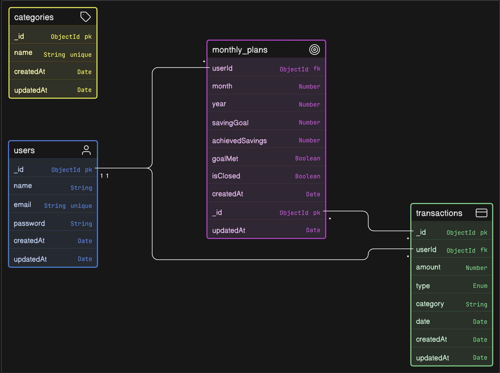

<div align="center">

# 💰 MoneyMatters

### A full-stack personal finance management application

[](./LICENSE)
[](https://nodejs.org/)
[](https://www.typescriptlang.org/)
[](https://www.mongodb.com/)
[](https://react.dev/)

MoneyMatters is a production-ready personal finance tracker that empowers users to manage income, expenses, monthly saving goals, and financial analytics — all through a clean, modern interface.

</div>

---

## 📋 Table of Contents

- [Overview](#-overview)
- [Tech Stack](#-tech-stack)
- [Architecture](#-architecture)
- [System Diagrams](#-system-diagrams)
- [Project Structure](#-project-structure)
- [Features](#-features)
- [API Reference](#-api-reference)
- [Data Models](#-data-models)
- [Setup & Installation](#-setup--installation)
- [Running the Project](#-running-the-project)
- [Testing](#-testing)
- [Environment Variables](#-environment-variables)
- [Team](#-team)
- [License](#-license)

---

## 🔍 Overview

MoneyMatters is a capstone system design project built as a monorepo with a decoupled frontend and backend. It follows a layered architecture pattern (Controller → Service → Repository → Model) on the backend, and a context-driven React SPA on the frontend.

Users can:
- Register and authenticate securely via JWT
- Log income and expense transactions with categories and dates
- Set monthly saving goals and close months to lock in results
- Visualize financial health through KPI cards, pie charts, and bar charts on a real-time dashboard

---

## 🛠 Tech Stack

### Frontend

| Technology | Version | Purpose |
|---|---|---|
| React | 19 | UI framework |
| TypeScript | ~6.0 | Type safety |
| Vite | 8 | Build tool & dev server |
| Tailwind CSS | v4 | Utility-first styling |
| Framer Motion | 12 | Animations & transitions |
| Recharts | 3 | Data visualization (pie, bar charts) |
| React Router | v7 | Client-side routing |
| Axios | 1.x | HTTP client with JWT interceptor |
| Lucide React | 1.x | Icon library |

### Backend

| Technology | Version | Purpose |
|---|---|---|
| Node.js | ≥ 18 | Runtime |
| Express | 5 | REST API framework |
| TypeScript | 6.0 | Type safety |
| MongoDB | — | NoSQL database |
| Mongoose | 9 | ODM for MongoDB |
| JWT (jsonwebtoken) | 9 | Stateless authentication |
| bcrypt | 6 | Password hashing |
| tsx | 4 | TypeScript execution & hot reload |

### Dev & Tooling

| Tool | Purpose |
|---|---|
| Jest + ts-jest | Unit testing |
| Prettier | Code formatting |
| ESLint | Linting |
| Husky + lint-staged | Pre-commit hooks |
| Docker | Containerization (backend) |

---

## 🏗 Architecture

MoneyMatters follows a **layered monorepo architecture** with a clear separation of concerns across both frontend and backend.

```
┌─────────────────────────────────────────────────────────┐
│                     React Frontend                       │
│  AuthContext → Pages → Axios (JWT Interceptor) → API    │
└────────────────────────┬────────────────────────────────┘
                         │ HTTP (REST)
┌────────────────────────▼────────────────────────────────┐
│                   Express Backend                        │
│                                                          │
│  Routes → authMiddleware → Controllers                   │
│               ↓                                          │
│           Services  (business logic)                     │
│               ↓                                          │
│         Repositories  (data access)                      │
│               ↓                                          │
│           Mongoose Models                                │
│               ↓                                          │
│             MongoDB                                      │
└─────────────────────────────────────────────────────────┘
```

### Backend Layers

| Layer | Responsibility |
|---|---|
| **Routes** | Define HTTP endpoints, apply middleware |
| **Middleware** | JWT auth validation, global error handling |
| **Controllers** | Parse requests, call services, return `ApiResponse` |
| **Services** | Business logic, validation, orchestration |
| **Repositories** | All MongoDB queries, data access abstraction |
| **Models** | Mongoose schemas and TypeScript interfaces |
| **Utils** | `ApiError`, `ApiResponse`, `asyncHandler` |

### Frontend Architecture

| Layer | Responsibility |
|---|---|
| **AuthContext** | Global JWT state, persisted via `localStorage` |
| **ProtectedRoute** | Guards authenticated routes, redirects to `/login` |
| **Pages** | Feature-level components (Dashboard, Transactions, MonthlyPlan) |
| **api.ts** | Axios instance with automatic `Authorization: Bearer` header injection |

---

## 📊 System Diagrams

### Class Diagram
> Illustrates the full class hierarchy, relationships, and method signatures across controllers, services, repositories, and models.


---

### Use Case Diagram
> Shows all system actors (Guest, Authenticated User, System) and the use cases they interact with, including include/extend relationships.


---

### Sequence Diagram — Close Month Workflow
> Details the end-to-end flow of the most complex operation: closing a month, calculating achieved savings, and evaluating goal completion.


---

### ER Diagram
> Entity-relationship model of the MongoDB collections — User, Transaction, MonthlyPlan, and Category — with cardinality and constraints.



---

## 📁 Project Structure

```
SystemDesign_CapStone_MoneyMatters/
├── assets/                          # System design diagrams
│   ├── CLASS DIAGRAM.png
│   ├── ER_DIAGRAM.png
│   ├── SEQUENCE DIAGRAM.png
│   └── USE CASE DIAGRAM.png
│
├── backend/
│   ├── src/
│   │   ├── controllers/             # Request handlers (AuthController, TransactionController, etc.)
│   │   ├── services/                # Business logic (AuthService, MonthlyService, DashboardService, etc.)
│   │   ├── repositories/            # MongoDB queries (UserRepository, TransactionRepository, etc.)
│   │   ├── models/                  # Mongoose schemas (User, Transaction, MonthlyPlan, Category)
│   │   ├── routes/                  # Express route definitions
│   │   ├── middlewares/             # authMiddleware, errorMiddleware
│   │   ├── utils/                   # ApiResponse, ApiError, asyncHandler
│   │   ├── types/                   # AuthPayload, Express Request augmentation
│   │   ├── config/                  # Database connection (db.ts)
│   │   ├── app.ts                   # Express app setup, CORS, route mounting
│   │   └── server.ts                # Entry point
│   ├── tests/
│   │   ├── controllers/             # Controller unit tests
│   │   ├── services/                # Service unit tests
│   │   ├── middlewares/             # Middleware unit tests
│   │   └── mocks/                   # Shared test mocks
│   ├── docs/
│   │   ├── devDoc.md                # Developer documentation
│   │   └── testDoc.md               # Testing documentation
│   ├── Dockerfile
│   ├── .env.example
│   ├── jest.config.cjs
│   ├── tsconfig.json
│   └── package.json
│
├── frontend/
│   ├── src/
│   │   ├── components/
│   │   │   ├── ui/                  # Reusable UI components (AuthSwitch)
│   │   │   ├── AppLayout.tsx        # Sidebar + Outlet layout wrapper
│   │   │   ├── ProtectedRoute.tsx   # JWT auth guard
│   │   │   └── Sidebar.tsx          # Navigation sidebar
│   │   ├── context/
│   │   │   └── AuthContext.tsx      # Global auth state (JWT + localStorage)
│   │   ├── pages/
│   │   │   ├── Dashboard.tsx        # KPIs, charts, goal progress
│   │   │   ├── Transactions.tsx     # Transaction list + add/delete modal
│   │   │   ├── MonthlyPlan.tsx      # Goal setting + performance history
│   │   │   ├── LoginPage.tsx
│   │   │   └── RegisterPage.tsx
│   │   ├── services/
│   │   │   └── api.ts               # Axios instance with JWT interceptor
│   │   ├── lib/
│   │   │   └── utils.ts             # cn() Tailwind class merge utility
│   │   ├── App.tsx                  # Router & route definitions
│   │   └── main.tsx
│   ├── public/
│   ├── tailwind.config.js
│   ├── vite.config.ts
│   └── package.json
│
├── .husky/                          # Git hooks (pre-commit lint + format)
├── eslint.config.js
├── package.json                     # Monorepo root scripts
└── LICENSE
```

---

## ✨ Features

| Feature | Description |
|---|---|
| **Authentication** | Register & login with JWT. Animated sign-in/sign-up switcher. |
| **Protected Routes** | Unauthenticated users are redirected to `/login` automatically. |
| **Persistent Session** | JWT stored in `localStorage`; session survives page refresh. |
| **Transaction Management** | Add income/expense transactions with category, amount, and date. Delete transactions. |
| **Dashboard Analytics** | Real-time KPI cards (earnings, spendings, total savings), expense category pie chart, income vs expense bar chart, and monthly goal progress bar. |
| **Monthly Saving Goals** | Set a saving target per month. Close the month to lock results and calculate whether the goal was met. |
| **Performance History** | View all past closed months with achieved savings and goal met/missed status. |
| **Error Handling** | Centralized `errorMiddleware` with structured `ApiError` responses. |
| **Input Validation** | Server-side validation on all endpoints (amount > 0, valid month/year, positive goal). |

---

## 🔌 API Reference

> All endpoints except `/api/auth/*` require the header:
> `Authorization: Bearer <token>`

### Auth — `/api/auth`

| Method | Endpoint | Body | Description |
|--------|----------|------|-------------|
| `POST` | `/register` | `{ name, email, password }` | Register a new user |
| `POST` | `/login` | `{ email, password }` | Login and receive JWT token |

### Transactions — `/api/transactions`

| Method | Endpoint | Body / Params | Description |
|--------|----------|---------------|-------------|
| `GET` | `/` | — | Get all transactions for authenticated user |
| `POST` | `/` | `{ amount, type, category, date }` | Create a new transaction |
| `DELETE` | `/:id` | `id` (param) | Delete a transaction by ID |

### Monthly Plan — `/api/monthly-plan`

| Method | Endpoint | Body | Description |
|--------|----------|------|-------------|
| `GET` | `/` | — | Get all monthly plans for authenticated user |
| `POST` | `/` | `{ month, year, savingGoal }` | Set a saving goal for a month |
| `POST` | `/close` | `{ month?, year? }` | Close the month and calculate savings |

### Dashboard — `/api/dashboard`

| Method | Endpoint | Query Params | Description |
|--------|----------|--------------|-------------|
| `GET` | `/` | `?month=&year=` | Get KPIs, category breakdown, pie data, and goal progress |

---

## 🗃 Data Models

### User
```ts
{
  _id:       ObjectId   // auto-generated
  name:      string     // required
  email:     string     // required, unique, lowercase
  password:  string     // bcrypt hashed
  createdAt: Date
  updatedAt: Date
}
```

### Transaction
```ts
{
  _id:      ObjectId              // auto-generated
  userId:   ObjectId              // ref: User (required)
  amount:   number                // required, must be > 0
  type:     "income" | "expense"  // required
  category: string                // required (e.g. Food, Rent, Salary)
  date:     Date                  // default: Date.now
  createdAt: Date
  updatedAt: Date
}
```

### MonthlyPlan
```ts
{
  _id:             ObjectId  // auto-generated
  userId:          ObjectId  // ref: User (required)
  month:           number    // 1–12 (required)
  year:            number    // required
  savingGoal:      number    // required, positive
  achievedSavings: number    // default: 0, computed on closeMonth
  goalMet:         boolean   // default: false, computed on closeMonth
  isClosed:        boolean   // default: false
  createdAt:       Date
  updatedAt:       Date
  // Unique index: (userId, month, year)
}
```

### Category
```ts
{
  _id:  ObjectId  // auto-generated
  name: string    // required, unique
  createdAt: Date
  updatedAt: Date
}
```

> **Note:** `Transaction.category` stores the category name as a plain string (denormalized). The `Category` collection serves as a reference/lookup but is not enforced via foreign key.

---

## ⚙️ Setup & Installation

### Prerequisites

- **Node.js** ≥ 18
- **MongoDB** running locally on port `27017`
- **npm** ≥ 9

> **macOS note:** Port `5000` is occupied by AirPlay Receiver. The backend defaults to port `4000`.

---

### 1. Clone the repository

```bash
git clone https://github.com/3ncryptor/SystemDesign_CapStone_MoneyMatters.git
cd SystemDesign_CapStone_MoneyMatters
```

### 2. Install all dependencies

```bash
# Install root monorepo dependencies
npm install

# Install backend dependencies
npm install --prefix backend

# Install frontend dependencies
npm install --prefix frontend
```

### 3. Configure environment variables

```bash
cp backend/.env.example backend/.env
```

Edit `backend/.env`:

```env
PORT=4000
MONGO_URI=mongodb://127.0.0.1:27017/money-management
JWT_SECRET=your_super_secret_key_here
```

---

## 🚀 Running the Project

### Development mode (from root)

```bash
# Start backend (tsx watch — hot reload)
npm run dev:backend

# Start frontend (Vite dev server)
npm run dev:frontend
```

Or run each separately:

```bash
# Backend — http://localhost:4000
cd backend && npm run dev

# Frontend — http://localhost:5173
cd frontend && npm run dev
```

### Production build

```bash
# Build backend (TypeScript → dist/)
npm run build

# Start compiled backend
npm run start
```

### Docker (Backend)

```bash
cd backend
docker build -t moneymatters-backend .
docker run -p 4000:4000 --env-file .env moneymatters-backend
```

---

## 🧪 Testing

Tests are located in `backend/tests/` and cover controllers, services, and middlewares.

```bash
# Run all backend tests
npm run test

# Or from backend directory
cd backend && npm run test
```

Test structure:

```
backend/tests/
├── controllers/
│   ├── auth.controller.test.ts
│   └── transaction.controller.test.ts
├── services/
│   ├── auth.service.test.ts
│   ├── dashboard.service.test.ts
│   ├── monthly.service.test.ts
│   └── transaction.service.test.ts
├── middlewares/
│   ├── auth.middleware.test.ts
│   └── error.middleware.test.ts
└── mocks/
    ├── user.mock.ts
    ├── transaction.mock.ts
    └── monthly.mock.ts
```

---

## 🔐 Environment Variables

| Variable | Required | Default | Description |
|---|---|---|---|
| `PORT` | No | `4000` | Port the Express server listens on |
| `MONGO_URI` | Yes | — | MongoDB connection string |
| `JWT_SECRET` | Yes | — | Secret key for signing JWT tokens |

---

## 👥 Team

| Name | Role | GitHub |
|------|------|--------|
| Aryan Vibhuti | Backend & Architecture | [@3ncryptor](https://github.com/3ncryptor) |
| Rajdeep Sanyal | Backend & API Design | [@rajdeep-2004](https://github.com/rajdeep-2004) |
| Piyush Yadav | Frontend Development | [@PiyushY111](https://github.com/PiyushY111) |
| Meet Ahuja | Frontend Development | [@MeetAhujaa](https://github.com/MeetAhujaa) |

---

## 📄 License

MIT © 2024 MoneyMatters Team

See [LICENSE](./LICENSE) for full details.

---

<div align="center">
  <sub>Built with ❤️ as a System Design Capstone Project</sub>
</div>
